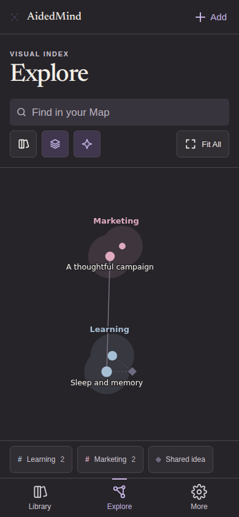

# v29 screen review

Fresh fixture captures reproduce the v28 defects and verify the v29 repair. These are browser-rendered screens from repository-owned Chromium/WebKit QA, not design mockups. Personal Library data and real publisher credentials were not used.

| Step | Screen | Health and evidence |
| --- | --- | --- |
| 1 | Library | Three mobile destinations are fully visible and clickable at 320px; the imprint is static. Search/filter behavior passes. Light and dark viewport captures reviewed. |
| 2 | Explore | Heading/search/actions have reserved space above the canvas; no toolbar covers theme labels. Mobile search spans the control width. Full/focused map, theme zoom, Fit All and synchronized list pass. Mobile dark and desktop light/dark captures reviewed. |
| 3 | More | Navigation remains reachable while settings expand. Backup, restore, ZIP, appearance and accessibility preferences pass. Expanded mobile capture reviewed; the existing transient restore toast is visible. |
| 4 | Breakdown | Reading hierarchy remains quiet with exactly Breakdown / Links / Notes. Literal source quote, sheet Escape/focus restoration and keyboard tabs pass. Desktop light capture reviewed. |
| 5 | Links | Connection reasons/origins remain visible; manual creation and Not related rejection persistence pass. Mobile light capture reviewed. |
| 6 | Notes | User text stays distinct from analysis. Saving/Saved/error and successful recovery pass without losing text. Mobile light capture reviewed. |
| 7 | Capture and recovery | Link preparation, partial diagnostics and inbox refresh preservation pass in the automated fixtures. Screenshots are in the QA artifact; these were not part of the selected visual review set. |

## Results

- 112 tests: 81 worker + 31 frontend, zero failures.
- 113 browser checks, zero failures; Chromium at 320/390/768/959/960/1280px, WebKit at 390/1280px.
- Both appearances, larger text, reduced motion, 320×568 map space and 320px navigation resizing are covered.
- Geometry checks include viewport bounds, 44px targets, hit testing, header overlap and toolbar/canvas/legend separation.
- Axe checks report no serious/critical violations in the exercised states.
- Wrangler dry-run passes: 644.06 KiB upload / 128.17 KiB gzip.
- Premium strict static audit: zero findings. The visual detector's cream warning is intentional under the explicit warm-paper brief; thick side borders were reduced to fine rules.
- Browser run: [36775797019](https://github.com/AidedMarketing/AidedMind/actions/runs/36775797019), frontend source commit `01beadda76b6a6b45969c704ff4166c17d4593cd`.
- Unit/bundle run: [36775796788](https://github.com/AidedMarketing/AidedMind/actions/runs/36775796788).
- Fresh baseline run: [36769572017, attempt 2](https://github.com/AidedMarketing/AidedMind/actions/runs/36769572017/attempts/2).

The local in-app browser was blocked because an administrator policy check could not be verified. The local workspace connection later closed, so selected fixture screenshots were retrieved through CI's review-image output. No interactive local preview, physical iPhone sharing, installed iOS PWA, VoiceOver or live deployment is claimed. Graph grouping/physics, capture/backend storage, links and rejection memory remain unchanged.

## Accepted mobile captures

